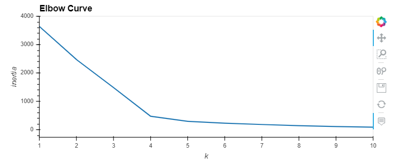
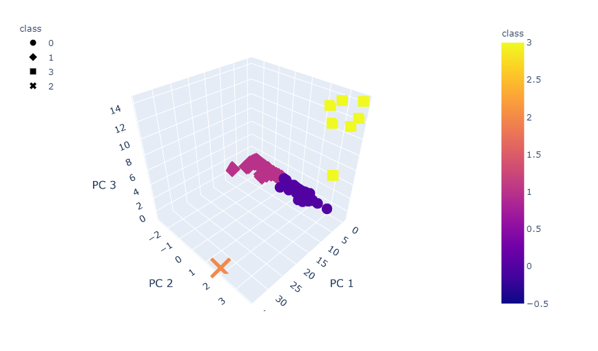

# Cryptocurrencies Analysis

## Project Overview
In this project, an analysis has been done to find out what cryptocurrencies are on the trading market
and how cryptocurrencies could be grouped toward creating a classification for developing a new 
investment product. 

## Software
Python, sklearn, K-means algorithm, PCA algorithm, Pandas, hvplot, plotly

## Summary
- Since there was no known output for what we are looking for, unsupervised learning has been used. 

- The Cryptocurrencies data given was not ideal, so it was preprocessed and scaled to fit the machine learning model. 

- The data dimensions were reduced to three principal components using PCA algorithm from sklearn.

- Clusters of Cryptocurrencies data were predicted by plotting the elbow curve to find the best value for K 
	using KMeans algorithm. By looking at the elbow curve, the best K value was found 4. The model was initialized 
	with 4 clusters using KMeans algorithm. The fitting and prediction of data were made based on this model.

- Data-Table, 3D-scatter and 2D-scatter plots have been used to show the status of the current tradable 
	cryptocurrencies with all the relevant informations.

### 3D-scatter plot with x="PC 1", y="PC 2" and z="PC 3"

### 2D-scatter plot with x="TotalCoinsMined" and y="TotalCoinSupply"

- From 2D-scatter plot, it can be seen that their are some outliers like "BitTorrent" and "TurtleCoin"